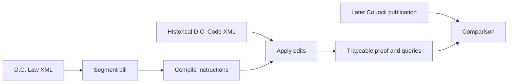

# In Its Place

**[Open the live proof desk](https://rishikrrontala-bot.github.io/lexhack-2026/)** · Built by **Rishik Rontala** for [LexHack 2026](https://lexhack-2026.devpost.com/)

**[Watch the 2½-minute captioned demo](submission/video/demo.mp4)** · [View the screenshot gallery](submission/gallery/)

> Paste a D.C. bill. Read the law it would make, with each edit traced to the instruction that caused it.

Bills often describe edits to an existing statute rather than show the resulting statute. In Its Place makes that intermediate step visible. The live prototype loads the Council's **Immunization of School Students Amendment Act of 2023** (D.C. Law 25-108), applies its twelve parsed instructions aimed at **D.C. Code § 38-501** to the Council's 2023-12-11 Code snapshot, and shows each change alongside its source sentence. The 2024-02-08 published section is retained as a comparison. The law text is editable, but replay is deliberately scoped to this one Code section.

## Try the judge path

1. Open the live site and press **Proof this bill**.
2. The default mark shows the phrase about a student being immunized replaced with text about immunizations received or exempted.
3. Select another instruction to inspect its before/after wording and source sentence.
4. Change a quoted phrase to one absent from the historical Code and proof again; the engine raises a query instead of inventing a change.

## Source and method



The [law](https://code.dccouncil.gov/us/dc/council/laws/25-108) and [Code section](https://code.dccouncil.gov/us/dc/council/code/sections/38-501) come from the [D.C. Council's public law XML](https://github.com/DCCouncil/law-xml) and [codified XML history](https://github.com/DCCouncil/law-xml-codified). The exact XML snapshots are checked into `data/source/`; `npm run data` regenerates the browser fixture. No API key, account, server, or LLM is required at runtime.

## Run locally

Requires Node 22.

```bash
npm ci
npm run data
npm test
npm run typecheck
npm run build
npm run dev
```

The browser app uses TypeScript and Vite. The parser, target resolver and edit applier are pure functions. The real-law integration test checks twelve parsed and applied instructions, the core amended paragraph, and refusal on a missing phrase.

## Limits and disclosure

This is a **one-section prototype**, not a general bill-to-law service. The complete replay is **not identical** to the Council's later codification: four added definitions contain editorial cross-reference updates, and one deletion leaves spacing that the codifier normalized. Read [limitations](docs/LIMITATIONS.md) before relying on any output. This is not legal advice or an official publication.

Built with TypeScript, Vite, Council public XML, Public Sans and Charis SIL. Rishik directed the work and used Claude Code (Anthropic) as an AI coding agent. The running legal edit compiler is deterministic and does not call an AI service.
